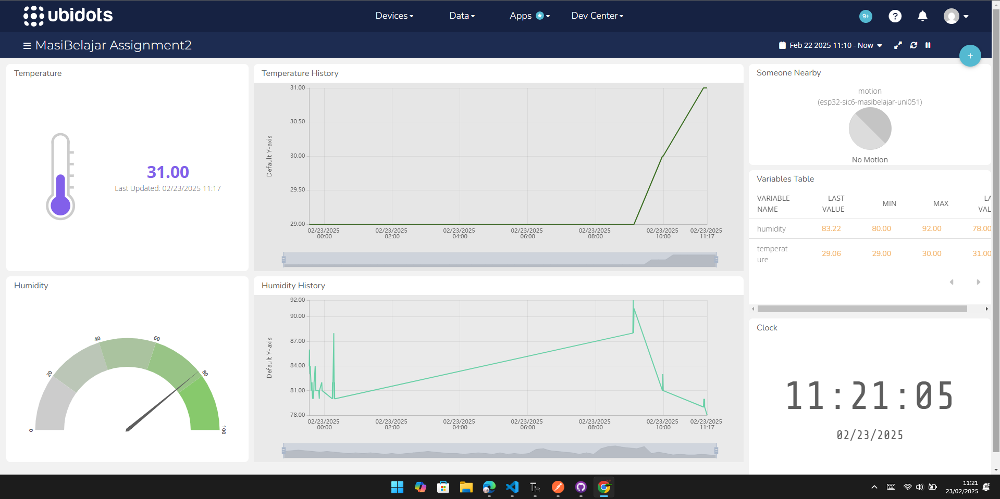

## How To Run Server

Ikuti langkah-langkah berikut untuk menjalankan server dengan benar:

1. Masuk ke direktori folder server:
   ```sh
   cd path/to/folder/server
   ```
2. *(Opsional)* Buat dan aktifkan virtual environment dengan menggunakan Python 3.12.
3. Jalankan perintah untuk menginstal dependensi:
   ```sh
   pip install -r requirements.txt
   ```
4. Buat file `.env` dari `.env.example`.
5. Jalankan server:
   ```sh
   flask run
   ```

Dengan demikian, Anda siap untuk menjalankan server dengan lancar! 😊


## Galeri Masi Belajar

### Ubidots


### IoT

**Rangkaian Full:**  


**Rangkaian Tampak Kanan:**  
  


**Rangkaian Tampak Kiri:**  


**Rangkaian Tampak Atas:**  


### Sensor

**DHT11 Sensor:**  


**PIR Sensor:**  


